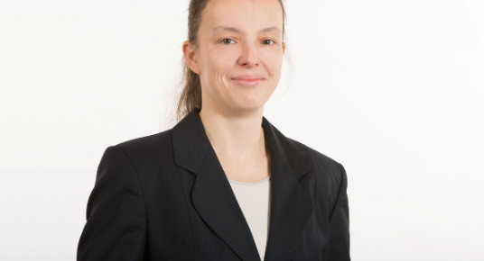

<html>
<body>
 

<table border="2">

<tr>
<td>  Área de Investigación:
 </td>

<td>  Macroeconomía , Macro-econometric input-output models. </td>

<tr>

<td>  Educación:
 </td>

<td>  PhD, University Osnabrück, 2017. 
</td>

</tr>

<tr>
<td>  Contacto: </td>

<td>  grossmann at gws-os.com  </td>

</tr>

<tr> 
<td >  Sitio Web:  </td> 
<td>  http://www.gws-os.com/de/index.php/wirtschaft-soziales/team/details/member/18.html  </td>

<tr>
<td> 
 Reseña:  </td>
<td> 
Sus áreas de interés son el desarrollo de modelos de pronósticos y la cuantificación de efectos de políticas macroeconómicas. Recientemente ha estado involucrada en el análisis de impacto económico y mediciones de política mediocambiental y su representación en los denominados E3 models (economy, energy, enviromental). 
</td>
</tr>
</tr>

</table> 

- <a href="equipo.html"> Volver a Equipo </a>

</body>

</html>