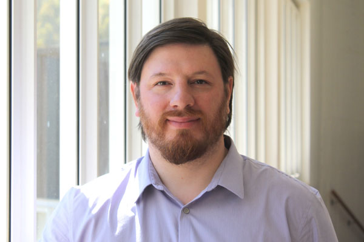

 
<html>
<head>

</head>
<body>
<ul>
  <li><a href="http://www.coforce.cl/index.html">Home</a></li>
  <li><a href="http://www.coforce.cl/equipo.html">Equipo</a></li>
  <li><a href="http://www.coforce.cl/quienessomos.html">COFORCE</a></li>
  <li><a href="http://www.coforce.cl/datos.html">Datos</a></li>
  <li><a href="http://www.coforce.cl/resultados.html">Resultados Preliminares</a></li>
  <li><a href="http://www.coforce.cl/publicacion.html">Publicaciones</a></li>
  <li><a href="http://en.coforce.cl/index.html">Inglés</a></li>
  <li><a href="http://ger.coforce.cl/index.html">Alemán</a></li>
  

</ul>

<h1> Juan Pedro Eberhard </h1>

<table border="2">

<tr>
<td>  Research:
 </td>

<td>  Macroeconomics and labor markets. </td>

<tr>

<td>  Education:
 </td>

<td>  Ph. D., Economics, Yale University, United States, 2010.
M. Phil., Economics, Yale University, United States, 2008. 
</td>

</tr>

<tr>
<td>  Contact: </td>

<td>  juan.eberhard@uai.cl  </td>

</tr>

<tr> 
<td >    Web  </td> 
<td> http://cepr.uai.cl/equipo/juan-pedro-eberhard-4/ </td>

<tr>
<td> 
 About:  </td>
<td> 
Assistant professor at the Escuela de Negocios of Universidad Adolfo. He was assistant profesor at Marshall School of Business, University of Southern California, USA. His research interest are Labor economics, macroeconomics and Computational economics. His works focuses on models with heterogenous agent models and  their applications to the accumulation of human capital.   
</td>
</tr>
</tr>
   

</table> 

- <a href="http://en.coforce.cl/equipo.html"> Team  </a>

</body>

</html>
