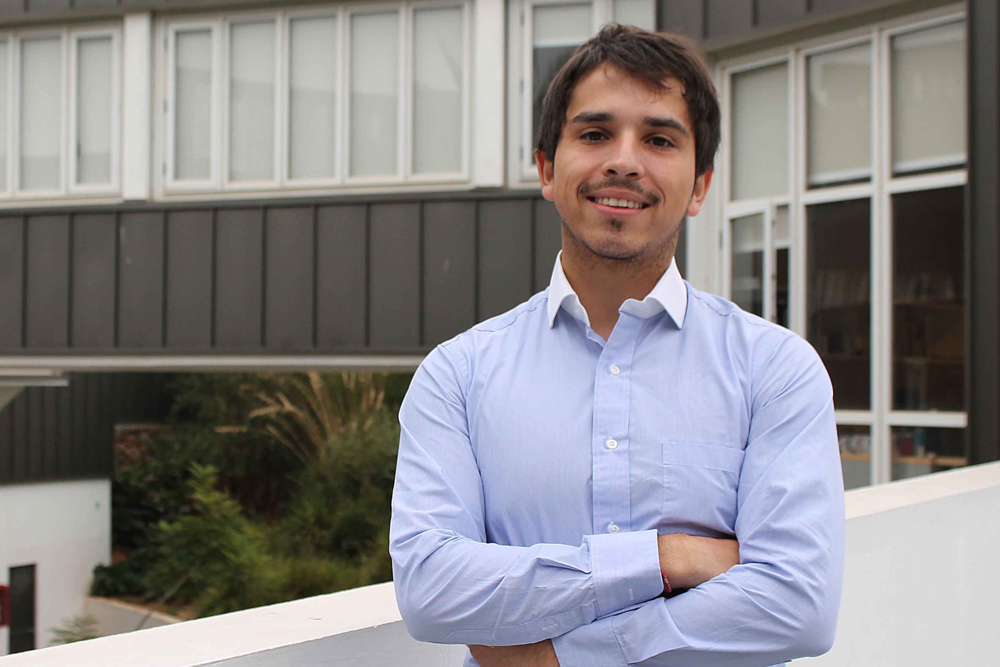

 
<html>
<head>

</head>
<body>

<ul>
  <li><a href="http://www.coforce.cl/index.html">Home</a></li>
  <li><a href="http://www.coforce.cl/equipo.html">Equipo</a></li>
  <li><a href="http://www.coforce.cl/quienessomos.html">COFORCE</a></li>
  <li><a href="http://www.coforce.cl/datos.html">Datos</a></li>
  <li><a href="http://www.coforce.cl/resultados.html">Resultados Preliminares</a></li>
  <li><a href="http://www.coforce.cl/publicacion.html">Publicaciones</a></li>
  <li><a href="http://en.coforce.cl/index.html">Inglés</a></li>
  <li><a href="http://ger.coforce.cl/index.html">Alemán</a></li>
  

</ul>

<h1> Felipe Morales </h1>

<table border="2">

<tr>
<td>  Research :
 </td>

<td>   Industrial Organization and Input-Output Analysis  </td>

<tr>

<td>  Education:

 </td>

<td> 
 Magíster en Economía, Universidad Adolfo Ibáñez

</td>

</tr>

<tr>
<td>  Contact: </td>

<td> f.morales@uai.cl </td>

</tr>

<tr> 
<td >  Sitio Web  </td> 
<td>  http://cepr.uai.cl/equipo/felipe-morales/ </td>

<tr>
<td> 
 Reseña:  </td>
<td> 

Felipe Morales is actually a research assistant of the Centro de Economía y Política Regional (CEPR), he has worken in topics related to input-output analysis, in the CONICY-BMBF 150061 project. His research interests are Industrial organization, Macroeconomic theory and Economic of Education.
         

 </td>
</tr>
</tr>

</table> 

- <a href="http://en.coforce.cl/equipo.html"> Team    </a>

</body>

</html> 