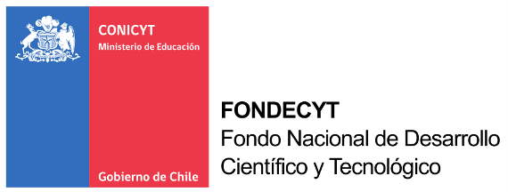
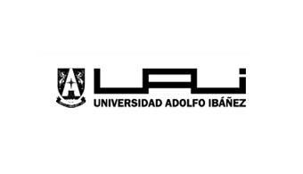

---
title:   COFORCE UAI-GWS 
---

###   Development of Sustainable Mining Strategies in Chile with a Regionalized National Model 

####   Context 

For Chile, the copper industry has historically been of great importance for the economy. This industry represented more than 50% of the total national exports for long periods of time. However, regarding its value added to the economy, the copper industry displays a low participation and a high degree of volatility. During 2003, the copper industry represented 8% of the national value added, but for 2007 this figure reached more than 20%.  According to the Chilean Central Bank, this volatility is associated with movements on international prices. 

Although the copper production is distributed in five out of 15 regions of Chile, most of the production is concentrated in the Antofagasta Region, and its two neighboring regions.

Since the beginning of the 90’s, and coinciding with the return to a democracy, the foreign investment in Chile has exponentially increased, and with it the mining production. This phenomenon has been the fundamental cause of the generation of employment and wealth in Chile.
The copper price dropped significantly during the period 2008- 2014.  Simultaneously, an increase in the extraction costs of copper led to a fall in the generation of wealth and employment, both nationally and regionally.  

Although current evaluations of the impact of movements of the mining industry on the national economy are performed through input-output matrices, models studying regional impacts are not available. Considering the high degree of concentration of the mining industry in Chile, these type of models may be relevant to introduce public policies aimed to the regional growth and development.

Therefore, Research teams from Universidad Adolfo Ibáñez and Gesellschaft für Wirtschaftliche Strukturforschung mbH have joined efforts, with the financial aid of CONICYT and the Bundesministerium für Bildung und Forschung, to develop models allowing to quantify the impact of the mining sector at regional level, and to generate better data at regional level of the effects of the copper price cycle, and other possible shocks to the mining sector. Moreover, the methodology developed could be applied to other sectors. 
 

<html>
<body>

 <h4>   Patrocinan  </h4> 

 

 

 

 <h4>  Desarrollan </h4> 

 

</body>
</html>